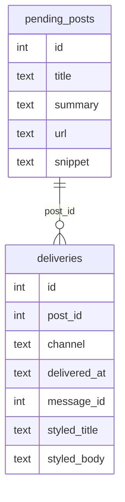

# Hype pipeline notes

## 3. Engine story vs channel post (flow_001174)

`pending_posts` is the engine story (English, immutable after Pass A).
`deliveries` is the channel post. Telegram Pass B writes `styled_title` /
`styled_body` / `message_id` onto the delivery via `mark_posted`. Nothing
styled is written to `pending_posts`.

## 4. Posting sequence

1. Pick hottest eligible engine row.
2. Style in memory (Pass B).
3. Send to Telegram.
4. `mark_posted(id, message_id, styled_title=..., styled_body=...)` inserts
   the `deliveries` row. A failed send is restyled on retry.

## 5. Story title vs Telegram headline (fixed 2026-09-08, flow_001165; split 2026-09-13, flow_001174)

**Incident:** `set_styled_content` overwrote `pending_posts.title` with the
Russian Telegram headline. `GET /api/v1/items` returned that headline to
GirlLM. A later incident still leaked Russian copy because `body` stayed on
the engine row.

**Fix:** `title` + `summary` are Pass A English on `pending_posts`. Channel
copy lives only on `deliveries`. The consumer API returns `title` + `summary`
and never Telegram fields.
